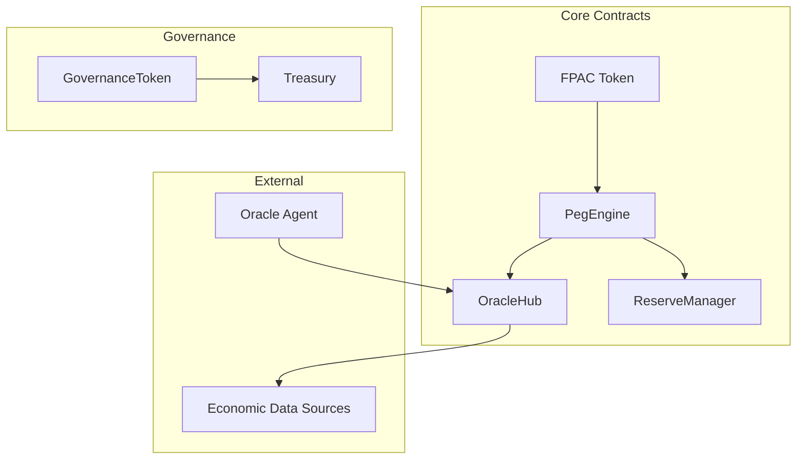

# FPAC (FAIT-Pegged Autonomous Currency) 🪙

A comprehensive blockchain-based currency system pegged to the Federal Asset Index Token (FAIT), featuring algorithmic monetary policy, real-time economic data integration, and automated peg maintenance.

## 📋 Table of Contents

- [Overview](#overview)
- [Features](#features)
- [Architecture](#architecture)
- [Smart Contracts](#smart-contracts)
- [Installation](#installation)
- [Deployment](#deployment)
- [Oracle System](#oracle-system)
- [Usage](#usage)
- [Security](#security)
- [Contributing](#contributing)
- [License](#license)

## 🎯 Overview

FPAC is a sophisticated decentralized stablecoin system that maintains its peg to FAIT through:

- **Algorithmic Monetary Policy**: Automated mint/burn operations based on real-time market conditions
- **Economic Data Integration**: Real-time CPI, basket prices, and economic indicators
- **Multi-Source Oracles**: Redundant data feeds with consensus mechanisms
- **Governance System**: Decentralized decision-making for protocol parameters
- **Reserve Management**: Collateralized backing with multiple asset types
- **Emergency Controls**: Fail-safe mechanisms for critical situations

## ✨ Features

### Core Functionality

- ✅ **ERC-20 Compatible**: Standard token interface with additional features
- ✅ **Algorithmic Peg Maintenance**: Automatic supply adjustments
- ✅ **Real-time Oracle Integration**: Live economic data feeds
- ✅ **Role-based Access Control**: Secure permission management
- ✅ **Emergency Pause System**: Circuit breakers for safety
- ✅ **Governance Token**: Decentralized protocol management

### Advanced Features

- ✅ **Multi-collateral Reserves**: Diversified backing assets
- ✅ **Confidence-weighted Oracles**: Data quality assessment
- ✅ **Rate Limiting**: Anti-manipulation protections
- ✅ **Vesting Schedules**: Token distribution management
- ✅ **Treasury Management**: Revenue and fee handling
- ✅ **Comprehensive Monitoring**: Detailed analytics and reporting

## 🏗️ Architecture



### System Components

1. **FPAC Token**: Main ERC-20 token with peg maintenance features
2. **PegEngine**: Core logic for maintaining price stability
3. **OracleHub**: Aggregates and validates economic data
4. **ReserveManager**: Manages collateral and backing assets
5. **GovernanceToken**: Enables decentralized governance
6. **Treasury**: Handles protocol funds and revenue
7. **Oracle Agent**: Automated data fetching and submission

## 📜 Smart Contracts

### FPAC.sol

Main token contract with:

- Standard ERC-20 functionality
- Controlled minting/burning
- Peg monitoring and reporting
- Emergency controls

### PegEngine.sol

Algorithmic monetary policy engine:

- Automated mint/burn operations
- Configurable parameters
- Operation rate limiting
- Manual intervention capabilities

### OracleHub.sol

Decentralized oracle system:

- Multi-source data aggregation
- Confidence-weighted consensus
- Data validation and staleness checks
- Oracle management

### ReserveManager.sol

Collateral management system:

- Multi-asset reserve backing
- Dynamic rebalancing
- Collateralization monitoring
- Emergency liquidity management

### GovernanceToken.sol

Governance and utility token:

- Voting functionality
- Delegation support
- Vesting schedules
- Permit support

### Treasury.sol

Protocol fund management:

- Revenue collection
- Automated distribution
- Multi-stream tracking
- Emergency controls

## 🚀 Installation

### Prerequisites

- **Node.js** 18+ and npm
- **Git** for version control
- **MetaMask** or compatible wallet
- **Testnet ETH** for deployment

### Quick Start

```bash
# Clone the repository
git clone https://github.com/your-org/fpac-currency-system.git
cd fpac-currency-system

# Install dependencies
npm install

# Copy environment configuration
cp .env.example .env

# Edit .env with your configuration
# - Add your private key
# - Configure RPC URLs
# - Set API keys

# Compile contracts
npm run build

# Run tests
npm test
```

### Environment Configuration

Create a `.env` file with the following variables:

```env
# Network Configuration
SEPOLIA_RPC_URL=https://sepolia.infura.io/v3/YOUR_INFURA_PROJECT_ID
MAINNET_RPC_URL=https://mainnet.infura.io/v3/YOUR_INFURA_PROJECT_ID

# Deployment Account
PRIVATE_KEY=your_private_key_without_0x_prefix

# API Keys
ETHERSCAN_API_KEY=your_etherscan_api_key
CPI_API_KEY=your_economic_data_api_key

# Oracle Configuration
ORACLE_PRIVATE_KEY=separate_oracle_account_private_key
ORACLE_HUB_ADDRESS=deployed_oracle_hub_address
```

## 🚀 Deployment

### Testnet Deployment (Sepolia)

```bash
# Deploy all contracts to Sepolia
npm run deploy:sepolia

# Verify contracts on Etherscan
npm run verify

# Start oracle agent
npm run oracle:start
```

### Mainnet Deployment

```bash
# Deploy to mainnet (use with caution)
npm run deploy:mainnet

# Verify contracts
npm run verify

# Configure production oracles
# Set up monitoring and alerts
```

### Deployment Process

The deployment script will:

1. **Deploy Core Contracts** in dependency order
2. **Configure Permissions** and role assignments
3. **Initialize Parameters** with safe defaults
4. **Submit Initial Oracle Data** for bootstrapping
5. **Generate Configuration Files** for oracle agents
6. **Output Contract Addresses** for verification

### Post-Deployment Checklist

- [ ] Verify all contracts on Etherscan
- [ ] Fund PegEngine with FPAC tokens for burn operations
- [ ] Set up oracle agents with proper API keys
- [ ] Configure monitoring and alerting
- [ ] Test peg maintenance operations
- [ ] Set up governance processes
- [ ] Configure treasury operations

## 🔮 Oracle System

### Oracle Agent Setup

The oracle agent automatically fetches and submits economic data:

```bash
# Navigate to oracle agent directory
cd oracle-agent

# Install dependencies
npm install

# Build the agent
npm run build

# Configure environment
cp .env.example .env
# Edit with your oracle private key and API keys

# Start the agent
npm start
```

### Data Sources

The system integrates with multiple data sources:

- **CPI Data**: Bureau of Labor Statistics (BLS)
- **Basket Prices**: Aggregated commodity prices
- **FAIT Price**: Exchange APIs and price aggregators
- **Economic Indicators**: Federal Reserve and economic databases

### Oracle Configuration

```json
{
  "network": {
    "rpcUrl": "https://sepolia.infura.io/v3/YOUR_PROJECT_ID",
    "chainId": 11155111,
    "oracleHubAddress": "0x..."
  },
  "updateIntervals": {
    "cpi": 3600000, // 1 hour
    "basketPrices": 1800000, // 30 minutes
    "faitPrice": 300000 // 5 minutes
  },
  "confidenceThresholds": {
    "minimum": 70,
    "target": 85
  }
}
```

## 💡 Usage

### Basic Token Operations

```typescript
// Get FPAC contract instance
const fpac = await ethers.getContractAt("FPAC", FPAC_ADDRESS);

// Check current peg status
const isPegMaintained = await fpac.isPegMaintained();
const currentPrice = await fpac.getCurrentPrice();
const targetPrice = await fpac.getTargetPrice();
const deviation = await fpac.getPegDeviation();

console.log(`Peg maintained: ${isPegMaintained}`);
console.log(`Current price: $${ethers.formatEther(currentPrice)}`);
console.log(`Target price: $${ethers.formatEther(targetPrice)}`);
console.log(`Deviation: ${deviation} basis points`);
```

### Peg Engine Operations

```typescript
// Get PegEngine instance
const pegEngine = await ethers.getContractAt("PegEngine", PEG_ENGINE_ADDRESS);

// Check if peg maintenance is needed
const [currentPrice, targetPrice, deviation, pegMaintained, canOperate] = await pegEngine.getPegStatus();

// Trigger peg maintenance (if you have OPERATOR_ROLE)
if (!pegMaintained && canOperate) {
  await pegEngine.maintainPeg();
}

// Get operation statistics
const [totalOps, totalMinted, totalBurned, lastOp, dailyOps] = await pegEngine.getOperationStats();
```

### Oracle Operations

```typescript
// Get OracleHub instance
const oracleHub = await ethers.getContractAt("OracleHub", ORACLE_HUB_ADDRESS);

// Submit data (if you have ORACLE_ROLE)
await oracleHub.submitData("FAIT_USD", priceInWei, confidence);

// Get latest data
const [value, timestamp, confidence, isValid] = await oracleHub.getLatestData("FAIT_USD");

// Check if data is stale
const isStale = await oracleHub.isDataStale("FAIT_USD");
```

### Reserve Management

```typescript
// Get ReserveManager instance
const reserveManager = await ethers.getContractAt("ReserveManager", RESERVE_MANAGER_ADDRESS);

// Check reserve status
const reserveData = await reserveManager.getReserveData();
const areReservesAdequate = await reserveManager.areReservesAdequate();

// Get asset information
const [balance, weight, minRatio, currentValue, isActive] = await reserveManager.getAssetInfo(tokenAddress);
```

## 🔒 Security

### Security Features

- **Role-based Access Control**: Granular permissions
- **Emergency Pause System**: Circuit breakers
- **Rate Limiting**: Anti-manipulation protections
- **Multi-signature Requirements**: Critical operations
- **Time Locks**: Governance changes
- **Oracle Consensus**: Data validation

### Security Best Practices

1. **Use Multi-sig Wallets**: For admin operations
2. **Monitor Operations**: Set up alerts and monitoring
3. **Regular Audits**: Smart contract security reviews
4. **Incident Response**: Prepared emergency procedures
5. **Key Management**: Secure private key storage
6. **Testing**: Comprehensive test coverage

### Emergency Procedures

In case of critical issues:

1. **Pause Operations**: Use emergency pause functions
2. **Oracle Override**: Manual data submission if needed
3. **Reserve Protection**: Emergency withdrawal procedures
4. **Communication**: Notify users and stakeholders
5. **Investigation**: Analyze and document incidents
6. **Recovery**: Implement fixes and resume operations

## 🧪 Testing

### Running Tests

```bash
# Run all tests
npm test

# Run specific test files
npx hardhat test test/FPAC.test.ts

# Run tests with gas reporting
REPORT_GAS=true npm test

# Run tests with coverage
npm run coverage
```

### Test Categories

- **Unit Tests**: Individual contract functionality
- **Integration Tests**: Multi-contract interactions
- **Oracle Tests**: Data feeding and validation
- **Governance Tests**: Voting and proposals
- **Emergency Tests**: Pause and recovery scenarios

## 📊 Monitoring and Analytics

### Key Metrics to Monitor

- **Peg Deviation**: Distance from target price
- **Operation Frequency**: Mint/burn operations per day
- **Oracle Health**: Data freshness and confidence
- **Reserve Ratio**: Collateralization level
- **Gas Usage**: Transaction costs
- **User Activity**: Token transfers and usage

### Recommended Monitoring Tools

- **The Graph**: Blockchain data indexing
- **Dune Analytics**: Custom dashboards
- **Tenderly**: Transaction monitoring
- **OpenZeppelin Defender**: Automated operations
- **Custom Scripts**: Tailored monitoring solutions

## 🤝 Contributing

We welcome contributions! Please see our [Contributing Guide](CONTRIBUTING.md) for details.

### Development Process

1. Fork the repository
2. Create a feature branch
3. Make your changes
4. Add tests for new functionality
5. Ensure all tests pass
6. Submit a pull request

### Code Standards

- Follow Solidity style guide
- Add comprehensive documentation
- Include unit tests
- Use meaningful commit messages
- Follow security best practices

## 📄 License

This project is licensed under the MIT License - see the [LICENSE](LICENSE) file for details.

## 🔗 Links

- **Documentation**: [docs.fpac.finance](https://docs.fpac.finance)
- **Governance**: [gov.fpac.finance](https://gov.fpac.finance)
- **Analytics**: [analytics.fpac.finance](https://analytics.fpac.finance)
- **Discord**: [discord.gg/fpac](https://discord.gg/fpac)
- **Twitter**: [@FPACCurrency](https://twitter.com/FPACCurrency)

## ⚠️ Disclaimer

This software is provided "as is" without warranty. Use at your own risk. The authors are not responsible for any losses incurred through the use of this software. Always conduct thorough testing and security audits before deploying to mainnet.

---

**Built with ❤️ by the FPAC Development Team**
